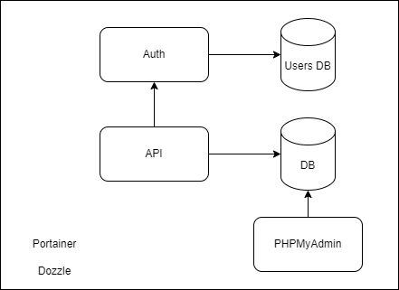

# IMDB 2

## Membrii echipei

* Torcea Octavian SSA-1C
* Tudorache Bogdan-Mihai SSA-1C
* Raluca Vasilache SSA-1C

## Descriere

Proiectul este o implementare a unei aplicatii de gestionare a filmelor. Administratorii pot crea si adauga filme noi in baza de date, iar utilizatorii pot cauta filme dupa anumite filtre si pot creea liste de filme preferate.

Pentru implementare folosim urmatoarele servicii:

* Serviciu de autentificare (auth) folosind tokeni JWT, implementat in Node.js
* Baza de date (Postgres SQL) folosita de serviciul de autentificare pentru inregistrarea utilizatorilor
* Serviciu principal, care ofera functionalitatile de gestionare a filmelor, implementat in Python
* Baza de date pentru filme (MySQL) folosita de serviciul principal
* Interfata de gestionare a bazei de date principale (PHPMyAdmin)
* Serviciu de vizualizare log-uri pentru toate containerele (Dozzle)
* Interfata de gestionare a containerelor (Portainer)

Felul in care interactioneaza serviciile poate fi vazut in diagrama urmatoare:

Am containerizat toate aceste servicii si am construit un stack docker-compose pe baza lor.

Pe baza stack-ului docker-compose am portat aplicatia pentru a fi rulata in Kubernetes. Serviciile ruleaza peste un cluster cu 2 workeri si un control plane. In deployment-ul pe Kubernetes am folosit Prometheus pentru monitorizare si dashboard-ul oferit de Kubernetes pentru logging in loc de Dozzle.

Am facut deploy la stack-ul de kubernetes pe Azure. Resursele de pe Azure au fost create folosind configuratii de Terraform. Serviciile pot fi accesate la urmatoarele rute:

* api: 4.157.142.24
* auth: 4.157.142.142