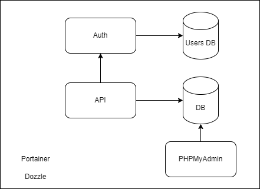

# IMDB 2

## Descriere

Proiectul este o implementare a unei aplicatii de gestionare a filmelor. Administratorii pot crea si adauga filme noi in baza de date, iar utilizatorii pot cauta filme dupa anumite filtre si pot creea liste de filme preferate.

Pentru implementare folosim urmatoarele servicii:

* Serviciu de autentificare (auth) folosind tokeni JWT, implementat in Node.js
* Baza de date (Postgres SQL) folosita de serviciul de autentificare pentru inregistrarea utilizatorilor
* Serviciu principal, care ofera functionalitatile de gestionare a filmelor, implementat in Python
* Baza de date pentru filme (MySQL) folosita de serviciul principal
* Interfata de gestionare a bazei de date principale (PHPMyAdmin)

Felul in care interactioneaza serviciile poate fi vazut in diagrama urmatoare:

